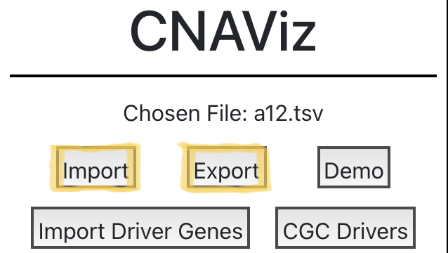
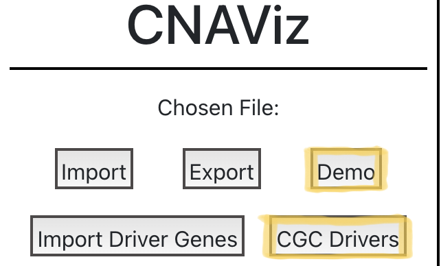
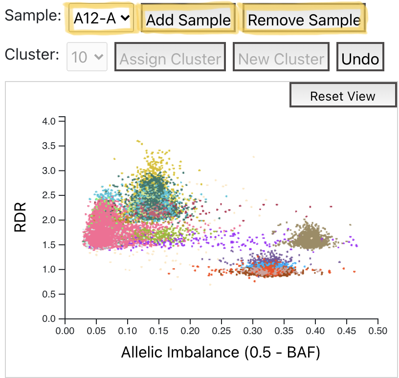
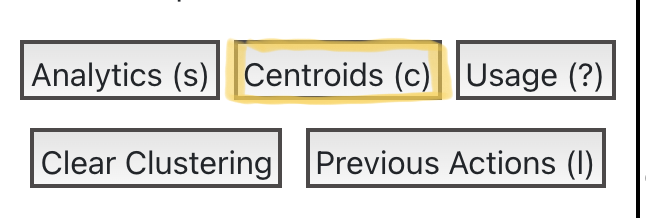
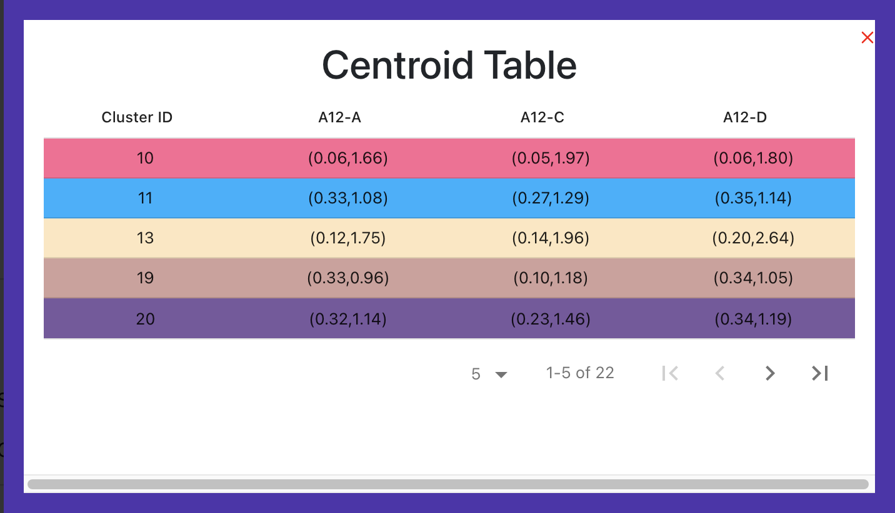

Click [here](https://www.youtube.com/watch?v=svOtiBadekw) to see a demo of the various features in CNAViz.

## Importing and Exporting

### Import
To import data, click the `Import` button at the top of the sidebar. The data must be a TSV file with the following columns: `#CHR`, `START`, `END`, `RD`, `BAF`, and optionally `CLUSTER`. If the `CLUSTER` column is not provided, then all bins are considered not clustered and assigned a temporary cluster ID of -1.
See [cnaviz-paper repo](https://github.com/elkebir-group/cnaviz-paper) for examples of files that would be considered valid input.

### Export
To export a clustering, simply click the `Export` button at the top of the sidebar. 
This button will download two files:

    1) A TSV file containing the same columns as the input and an updated CLUSTER column.
    2) A file containing a log of all the actions taken.

## Demo Buttons
To immediately get started with CNAViz, there are 2 demo buttons available in the sidebar. The `Demo` button will automatically import the a12.tsv file from the data folder. The `CGC Drivers` button will automatically import a list of driver genes from the COSMIC Cancer gene census.

## Viewing Multiple Samples
Clicking the `Add/Remove Sample` buttons above the scatter plot will add/remove a scatter-linear plot pair to/from the screen. The `Add Sample` button will be disabled when there are no more samples to add. The `Remove sample` is disabled when there is only 1 sample being viewed. To switch which sample is being viewed by a scatter-linear plot pair, the sample dropdown above the scatter plot can be used.

## Zooming / Panning
### Zooming
When in zoom/pan mode, the magnifying icon to the right of the sidebar will be highlighted red. To zoom in/out, hover over a plot and use the mouse wheel or trackpad.
### Bounding Box Zoom
A bounding box zoom can be used by holding down `Shift` and then clicking and dragging on a plot (while in zoom/pan mode).
### Panning
To pan on the scatter plot, simply click and drag while in zoom/pan mode.
### Reset Zoom
To reset any zooming/panning applied to a plot, click the `Reset View` button at the top right of the plot.

## Selecting Bins
### Adding to Selection
To add to a selection, first enter add-to-selection mode by clicking on the mouse pointer icon to the right of the sidebar. The icon should be highlighted red once clicked on. Then, clicking and dragging on a plot will create a bounding box that can be used to selected bins. When a point/bin is selected, the color of the point will change to a dark blue color.

### Removing from Selection
To remove bins from a selection, first enter remove-from-selection mode by clicking on the eraser icon to the right of the sidebar. The icon should be highlighted red once clicked on. Then, clicking and dragging on a plot will create a bounding box that can be used to remove selected bins. The color of the point/bin will return to the original color it had before it was selected.

### Clear Selection
To quickly remove all bins from the selection, click (without dragging) on the plot while in add-to-selection mode.

## Clustering
Once points are selected, they can now be assigned to a cluster.

### Adding selected bins to an existing cluster
To add the points to an existing cluster, choose the desired cluster from the `Cluster` dropdown above any of the scatter-linear plot pair. Then, click `Assign Cluster`.

### Erasing bins
The `Cluster` dropdown has an option of -2 which represents an erased state. This state means that those bins will not be included in the exported file.

### Not clustered state
The `Cluster` dropdown also has an option of -1 which represents a not clustered state. This state is a temporary cluster ID for bins that are not yet clustered. By default, all the bins are assigned to this state when the `CLUSTER` column is not provided in the data. In addition, this is the state used when the `Clear Clustering` button is clicked in the sidebar.

### New cluster
To assign the bins to a new cluster (a cluster ID that has not been used yet), click the `New Cluster` button above any scatter-linear plot pair. This button will assign the selected bins to the next cluster ID available.

### Undo action
If a mistake is made after assigning bins to a cluster, the action can be undone by clicking the `Undo` button above any scatter-linear plot pair.

### Clearing the clustering
To restart a clustering from scratch, click the `Clear Clustering` button in the sidebar. This button will assign all bins to cluster ID -1.

### Changing cluster colors
To change the color of a cluster, go to the cluster table in the sidebar and click the arrow (`>`) symbol next to the checkbox. A dropdown will appear where there are color options and a custom hex color input field. 

## Analytics
To view cluster analytics such as distances between clusters and silhouette scores, click the `Analytics (s)` button in the sidebar. A pop-up with 2 bar plots will be displayed. 

The first bar plot has the approximate average silhouette score for every cluster. Click [here](https://en.wikipedia.org/wiki/Silhouette_%28clustering%29) to see more information about this metric.

The second bar plot contains approximate average euclidean inter-cluster distances. To choose which cluster the distances should be calculated from, use the dropdown above the bar plot.

## Filtering
There are a number of ways to filter the bins displayed in the scatter plots and linear plots.

### Filter by clusters
To filter by cluster, use the cluster table at the bottom of the sidebar. The colors in the table corresponding to the cluster colors in the plots. Use the checkboxes in each row to pick which clusters should be displayed. This cluster table can also be sorted by cluster ID or Bin(%) by hovering over the `cluster ID` or `Bin (%)` in the header row and clicking.

### Filter by chromosome
To filter by chromosome, use the `Chromosome` dropdown in the sidebar.

### Filter to a specified genomic range
To filter to a genomic range, use the bounding box zoom on the linear plot. The scatter plot will be kept in sync with the linear plot and show the same points.

## Driver Genes
To mark important driver genes along the x-axis of the linear plots, use the `Import Driver Genes` button in the sidebar. The uploaded file should be a TSV file with the following columns: `symbol` and `Genomic Position`. The `Genomic Position` column should be of the format [CHR]:[START]-[END]. See drivers.tsv in the data folder for an example of a file that would be considered as valid input.

## Other features
Here are some other features provided that may be helpful.

### View Previous Actions
To see a log of previous actions taken, click the `Previous Actions (l)` button in the sidebar. This log will be exported when the `Export` button is clicked.

### Toggle scatter plots and linear plots
Use the `Scatterplots` and `Linear Plots` checkboxes in the sidebar to choose which plots should be displayed.
By default, both are displayed.

### Switching to log RDR scale
To switch the RDR y-axis scales to logarithmic scale , use the `log RDR` checkbox in the sidebar.

### Centroids
To display the centroids of each cluster, use the `Centroids` checkbox in the sidebar. This toggle will plot the centroids on the scatter plots. The centroids that are displayed will be kept in sync with the cluster filters set by the cluster table. 

To view the exact location of the centroids in each sample, click the `Centroids (c)` button in the sidebar. This button will bring up a pop-up with a table containing the centroids of every cluster.

### View usage reference
To view directions about different shortucts and functionality, click the `Usage (?)` button in the sidebar.

## Key Modifiers Summary
`Command/Ctrl` -> temporarily enter add-to-selection mode (once released goes back to zoom/pan mode)
`Option/Alt` -> temporarily enter remove-from-selection mode (once released goes back to zoom/pan mode)
`Shift` (in zoom/pan mode) -> bounding box zoom
`e` -> enter remove-from-selection mode
`b` -> enter add-to-selection mode
`z` -> enter zoom/pan mode
`c` -> toggle centroid table
`s` -> toggle cluster analytics
`l` -> toggle previous actions table
`?` or `/` -> usage reference
`Space` -> toggle sidebar

